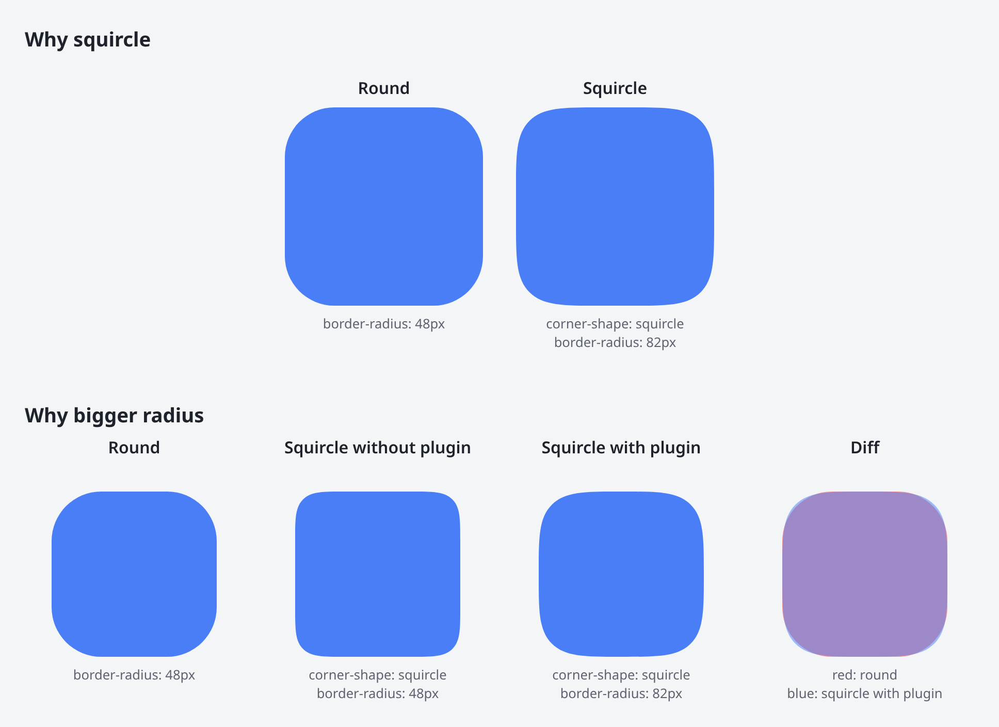

# PostCSS Smooth Corners


[PostCSS] plugin to use smooth squircle corners on your website.
See [demo](https://postcss.github.io/postcss-smooth-corners/).

Round corners start suddenly. Squircle corners start slowly and smoothly.
Because of this, they look softer, like iPhone icons. Browsers now support
them with [`corner-shape: squircle`].

The plugin has 2 modes:

- **Fix size** (default): you add `corner-shape: squircle` where you need it.
  The plugin increases `border-radius`, because with the same radius
  a squircle looks smaller than a round corner.
- **Auto squircle** (`auto: true`): the plugin adds `corner-shape: squircle`
  to every `border-radius` and fixes the size.

In both modes, browsers without `corner-shape` support will keep round corners
with the original radius.

<p align="center">
  <a href="https://postcss.github.io/postcss-smooth-corners/">
    <picture>
      <source media="(prefers-color-scheme: dark)" srcset="./test/demo/screenshot-dark.png">
      
    </picture>
  </a>
</p>

```css
/* Input CSS */
.card {
  corner-shape: squircle;
  border-radius: 1rem;
}
```

```css
/* Output CSS */
.card {
  corner-shape: squircle;
  border-radius: 1rem;
  @supports (corner-shape: squircle) {
    border-radius: 1.715rem;
  }
}
```

[`corner-shape: squircle`]: https://developer.mozilla.org/en-US/docs/Web/CSS/corner-shape
[PostCSS]: https://github.com/postcss/postcss

---

 Postcss Smooth Corners is built by <b><a href="https://evilmartians.com/">Evil Martians</a></b>, an American design and engineering consultancy for <b>developer tools, AI, and cybersecurity startups</b>.

---

## Usage

**Step 1:** Install plugin:

```sh
npm install --save-dev postcss postcss-smooth-corners
```

**Step 2:** Check your project for existing PostCSS config: `postcss.config.js`
in the project root, `"postcss"` section in `package.json`
or `postcss` in bundle config.

If you do not use PostCSS, add it according
to [official docs](https://github.com/postcss/postcss#usage)
and set this plugin in settings.

**Step 3:** Add the plugin to plugins list:

```diff
+ import smoothCorners from 'postcss-smooth-corners'

  export default {
    plugins: [
+     smoothCorners(),
      autoprefixer
    ]
  }
```

The output CSS uses CSS Nesting. If you need to support old browsers,
put [`postcss-nesting`] after this plugin.

[`postcss-nesting`]: https://github.com/csstools/postcss-plugins/tree/main/plugins/postcss-nesting

## Modes

### Fix Size

By default, the plugin changes only rules with `corner-shape: squircle`.
It increases `border-radius` by 1.715 (and rounds pixels) inside
`@supports`, so the squircle will have the same visual size as the round
corner from the design.

```js
smoothCorners()
```

```css
/* Input CSS */
.card {
  corner-shape: squircle;
  border-radius: 10px;
}
.button {
  border-radius: 10px;
}
```

```css
/* Output CSS */
.card {
  corner-shape: squircle;
  border-radius: 10px;
  @supports (corner-shape: squircle) {
    border-radius: 17px;
  }
}
.button {
  border-radius: 10px;
}
```

### Auto Squircle

With `auto: true`, the plugin makes all corners squircle. It adds
`corner-shape: squircle` to every `border-radius` and fixes the size.
It doesn’t change circles (`50%` or more) and very small radius.

```js
smoothCorners({ auto: true })
```

```css
/* Input CSS */
.card {
  border-radius: 1rem;
}
.avatar {
  border-radius: 50%;
}
```

```css
/* Output CSS */
.card {
  corner-shape: squircle;
  border-radius: 1rem;
  @supports (corner-shape: squircle) {
    border-radius: 1.715rem;
  }
}
.avatar {
  border-radius: 50%;
}
```

Set `corner-shape: round` to keep round corners for a specific rule.

## Options

### `autoMinSize`

In `auto` mode, radius smaller than this value (in pixels) will keep
round corners.
Default is `5`.

```js
smoothCorners({ auto: true, autoMinSize: 8 })
```

### `props`

Regexp for custom properties with radius values. The plugin can’t increase
radius inside `var()`, so you can increase the values of your design tokens
instead.

```js
smoothCorners({ props: /^--radius-/ })
```

```css
/* Input CSS */
:root {
  --radius-m: 8px;
}
```

```css
/* Output CSS */
:root {
  --radius-m: 8px;
  @supports (corner-shape: squircle) {
    --radius-m: 14px;
  }
}
```

## Inheritance

The plugin adds `corner-shape: inherit` to `border-radius: inherit` to copy
the corner shape together with the radius from the parent.

```css
/* Input CSS */
.card {
  corner-shape: squircle;
  border-radius: 1rem;
}
.card img {
  border-radius: inherit;
}
```

```css
/* Output CSS */
.card {
  corner-shape: squircle;
  border-radius: 1rem;
  @supports (corner-shape: squircle) {
    border-radius: 1.715rem;
  }
}
.card img {
  corner-shape: inherit;
  border-radius: inherit;
}
```
